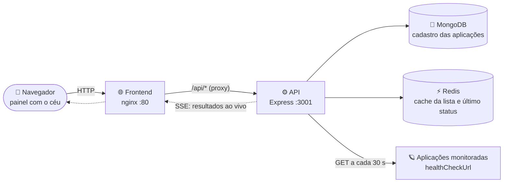

# 🪐 Orbital


[](LICENSE)

Dashboard de monitoramento de saúde de aplicações com visualização orbital. Cada aplicação é representada como um planeta em órbita — o brilho do planeta indica o resultado do último health check.

## 🌌 Conceito

A metáfora orbital transforma um painel de status convencional em uma visualização espacial construída com D3.js. Planetas verdes indicam aplicações saudáveis, âmbar indicam lentidão (degradado) e vermelhos indicam falha; cinza é uma aplicação ainda não verificada. O sistema suporta múltiplos ambientes (desenvolvimento, homologação e produção), cada um com sua própria constelação de aplicações.

## 🏗️ Arquitetura

**O servidor verifica, o painel só mostra.** O navegador nunca testa as aplicações: ele recebe os resultados prontos da API por uma conexão que fica aberta.



### Como funciona

1. **A API agenda os checks.** A cada `HEALTH_CHECK_INTERVAL_S` (padrão 30 s) ela faz um `GET` no `healthCheckUrl` de cada aplicação. Os ambientes rodam defasados (produção em 0 s, homologação em 10 s, desenvolvimento em 20 s) para não baterem juntos nos serviços monitorados.
2. **Cada resultado é publicado na hora** no stream SSE `GET /applications/events` e guardado no Redis.
3. **O painel só escuta.** Ao conectar, recebe um snapshot com o último status de cada aplicação; depois, só as mudanças. Recarregar a página nunca dispara um check, e abrir mais abas não gera mais tráfego para as aplicações.
4. **"Sincronizar" força um ciclo** do ambiente na tela (`POST /applications/:env/sync`, que responde `202`). Os resultados chegam pelo mesmo stream.

### Status

| Planeta | Status | Quando |
|---|---|---|
| 🟢 verde | `healthy` | Respondeu 2xx em menos de `DEGRADED_LATENCY_MS` (padrão 3 s) |
| 🟡 âmbar | `degraded` | Respondeu 2xx, mas acima de `DEGRADED_LATENCY_MS` |
| 🔴 vermelho | `unhealthy` | Erro HTTP, falha de rede ou timeout (`HEALTH_CHECK_TIMEOUT_MS`, padrão 5 s) |
| ⚪ cinza | — | Ainda não verificada; entra no próximo ciclo do ambiente |

### Estrutura do código

| Pasta | Conteúdo |
|---|---|
| `frontend/` | Página estática servida pelo nginx: marcação em `index.html`, lógica em `script.js`. O nginx encaminha `/api/` para a API. |
| `api/` | REST API Node.js + Express em camadas: `routes/` → `controllers/` → `services/` → `repositories/`, mais `config/`, `middlewares/`, `validators/` e `utils/`. |

> [!WARNING]
> Rode a API com **uma única instância**. O agendador e o envio de eventos ficam em memória, então várias réplicas checariam cada aplicação mais de uma vez.

## ✨ Funcionalidades

- 🔭 **Visualização orbital** — aplicações como planetas animados em D3.js; a cor reflete o status atual
- 🌍 **Multi-ambiente** — alternância entre Desenvolvimento, Homologação e Produção
- ⏱️ **Health check automático no servidor** — ciclos a cada `HEALTH_CHECK_INTERVAL_S`, com resultados em tempo real via SSE
- 📡 **Sincronização manual** — botão Sincronizar força um ciclo imediato do ambiente na tela
- ➕ **Cadastro de aplicações** — formulário para adicionar nome, time, ambiente, URL de health check e Swagger
- 🗑️ **Remoção de aplicações** — exclusão com confirmação diretamente no card
- 🔍 **Seleção pela órbita** — clique em um planeta para destacar o card da aplicação (com o link do Swagger)
- 🔎 **Filtros e busca** — filtre por status (no ar / degradado / fora) e busque por nome ou time
- 📄 **Paginação** — lista de aplicações paginada por ambiente
- 🌗 **Tema claro/escuro** — alternância com persistência no localStorage
- 🔔 **Alertas de queda** — notificação do navegador e bipe quando uma aplicação cai com a aba em segundo plano, e contador no título da página
- ⛈️ **Modo tempestade** — se a API fica inacessível, o céu vira tempestade e os status aparecem como "último conhecido" até a conexão voltar

## 🚀 Como utilizar

### Pré-requisitos

- 🐳 [Docker](https://docs.docker.com/get-docker/) com Docker Compose

---

### 🖥️ Modo local

Sobe todos os serviços em containers — ideal para desenvolvimento e testes.

```bash
docker compose -f docker-compose.local.yml up -d --build
```

| Serviço      | URL                        | Descrição               |
|--------------|----------------------------|-------------------------|
| 🌐 Frontend  | http://localhost           | Painel Orbital (nginx)  |
| ⚙️ API       | http://localhost:3001      | REST API                |
| 🍃 MongoDB   | mongodb://localhost:27017  | Banco de dados          |
| 🔴 Redis     | localhost:6379             | Cache e último status   |

> O banco é populado automaticamente com dados de exemplo na primeira inicialização. Nas reinicializações seguintes os dados persistem no volume `mongo_data`.

---

### 🏭 Modo produção

Sobe apenas frontend e API em containers. MongoDB e Redis são serviços externos já existentes (nuvem, on-premise, etc.).

```bash
cp api/.env.prod.example api/.env.prod   # preencha com os dados dos serviços externos
docker compose -f docker-compose.prod.yml up -d --build
```

| Serviço      | URL                   | Descrição              |
|--------------|-----------------------|------------------------|
| 🌐 Frontend  | http://localhost      | Painel Orbital (nginx) |
| ⚙️ API       | http://localhost:3001 | REST API               |

As credenciais dos serviços externos são lidas do arquivo `api/.env.prod`:

| Variável         | Descrição                               |
|------------------|-----------------------------------------|
| `MONGO_URL`      | URL de conexão com MongoDB externo      |
| `MONGO_USER`     | Usuário do MongoDB (opcional)           |
| `MONGO_PASS`     | Senha do MongoDB (opcional)             |
| `MONGO_DB`       | Nome do banco de dados                  |
| `REDIS_URL`      | URL de conexão com Redis externo        |
| `HEALTH_CHECK_INTERVAL_S` | Intervalo (segundos, mínimo 5) entre os health checks agendados de cada ambiente (padrão 30) |
| `APPS_CACHE_TTL` | Validade (segundos) do cache da lista de aplicações no Redis; `0` desliga |
| `HEALTH_CHECK_CONCURRENCY` | Máximo de health checks simultâneos por ciclo |
| `DEGRADED_LATENCY_MS` | Tempo de resposta (ms) acima do qual a aplicação fica degradada |
| `HEALTH_CHECK_TIMEOUT_MS` | Tempo máximo (ms) de cada health check antes de marcar a aplicação como fora do ar |

---

### 🔧 Desenvolvimento sem Docker

**API:**

```bash
cd api
cp .env.example .env   # ajuste as variáveis conforme necessário
npm install
npm run dev
```

**Frontend:**

Não há etapa de build, mas o frontend chama a API por caminho relativo (`/api/...`), então **não funciona aberto via `file://`**. Ele precisa ser servido pelo nginx do container, que encaminha `/api/` para o serviço `api`. Para ver uma alteração, rebuilde só o frontend (é rápido, só copia os arquivos estáticos):

```bash
docker compose -f docker-compose.local.yml up -d --build frontend
```

> Certifique-se de que MongoDB e Redis estejam rodando para a API.

### ⚙️ Variáveis de ambiente da API

| Variável          | Padrão                        | Descrição                               |
|-------------------|-------------------------------|-----------------------------------------|
| `PORT`            | `3001`                        | Porta da API                            |
| `MONGO_URL`       | `mongodb://localhost:27017`   | URL de conexão com MongoDB              |
| `MONGO_DB`        | `orbital`                     | Nome do banco de dados                  |
| `REDIS_URL`       | `redis://localhost:6379`      | URL de conexão com Redis                |
| `HEALTH_CHECK_INTERVAL_S` | `30`                  | Intervalo (segundos, mínimo 5) entre os health checks agendados de cada ambiente |
| `APPS_CACHE_TTL`  | `7200`                        | Validade (segundos) do cache da lista de aplicações no Redis; `0` desliga. Edições feitas direto no Mongo só aparecem depois desse prazo |
| `HEALTH_CHECK_CONCURRENCY` | `10`                 | Máximo de health checks simultâneos por ciclo |
| `DEGRADED_LATENCY_MS` | `3000`                    | Tempo de resposta (ms) acima do qual a aplicação fica degradada |
| `HEALTH_CHECK_TIMEOUT_MS` | `5000`                  | Tempo máximo (ms) de cada health check antes de marcar a aplicação como fora do ar |
| `LOG_LEVEL`       | `info`                        | Nível mínimo dos logs (JSON, uma linha por evento): `info`, `warn` ou `error` |

Um valor inválido (ex.: `HEALTH_CHECK_INTERVAL_S=abc`) impede a API de subir, com o erro no log.

### 📡 Endpoints da API

| Método | Rota                          | Descrição                              |
|--------|-------------------------------|----------------------------------------|
| `GET`  | `/applications`               | Lista todas as aplicações              |
| `GET`  | `/applications/events`        | Stream SSE com os status dos três ambientes (`?changes=true` só envia mudanças) |
| `POST` | `/applications/:env/sync`     | Força um ciclo de health check (202); o resultado chega pelo SSE |
| `POST` | `/applications/:env`          | Cadastra uma aplicação                 |
| `DELETE` | `/applications/:env/:id`    | Remove uma aplicação                   |

Ambientes válidos: `development`, `staging`, `production`. Não há endpoint de edição: alterar uma aplicação existente exige editar o Mongo (e esperar o `APPS_CACHE_TTL` ou apagar a chave `orbital:apps:<env>` no Redis).

### 🧪 Testes

Testes unitários da API com Jest + Supertest, sem precisar de Mongo, Redis ou rede:

```bash
cd api
npm test
npm run test:coverage
```
